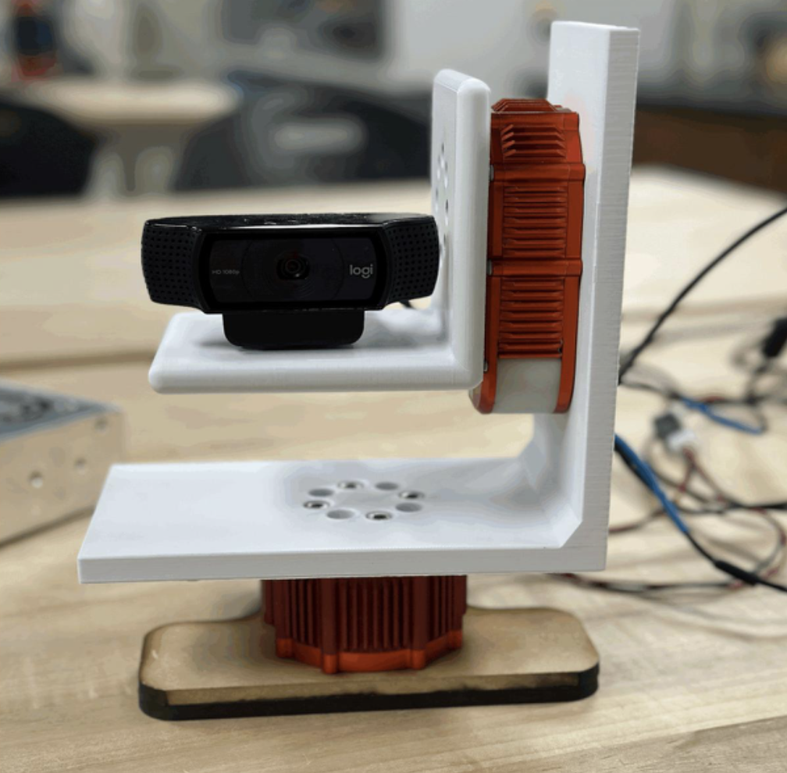
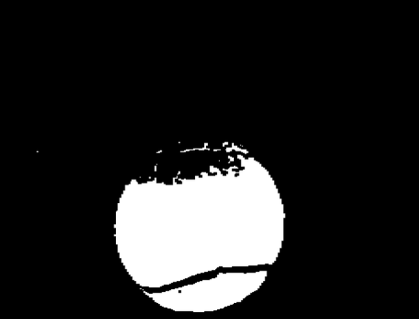
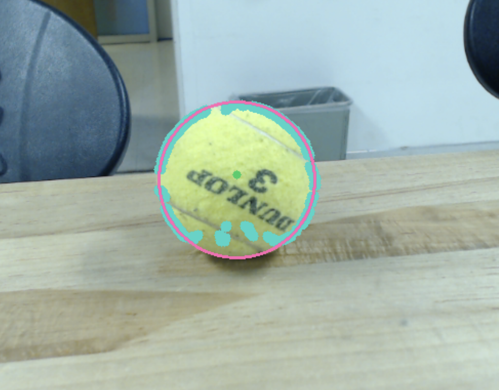

# Computer Vision Detection and Tracking Robotics Project
A mobile robot that uses computer vision and real-time image processing to detect and track a ball. Developed in Caltech’s Introduction to Robotics course, this project focused on vision-based algorithms, image filtering, and motion planning. The system processes live video input to identify and follow a moving ball, demonstrating autonomous behavior through software-driven control. Watch the [DEMO](https://www.youtube.com/watch?v=-PGfyatwvf8).

   
  <em>Front View of Robot.</em>

## Features
### Smooth Motion Control
- Motor positions and velocities are planned using cubic spline interpolation for both pan and tilt axes.
- At each control loop iteration, the system calculates updated commands based on current feedback and target positions.
- Real-time adjustments ensure smooth transitions, avoiding abrupt starts or stops while accurately following dynamic targets.
- Data logging and visualization of positions and velocities allow verification of tracking performance and system accuracy.
- Full mathematical derivations and implementation details are available in the [Software Architecture Report](Software-Architecture-Report.pdf).

### Object Detection & Tracking
- Color-based segmentation isolates the tennis ball from the background, and morphological filtering (erode/dilate) removes noise while preserving shape.
- Contours are processed to identify valid objects, with centroids calculated for precise tracking.
- Full implementation details and visualizations of the filtering process are included in the [Object Detector Report](Object-Detector-Report.pdf).

   
  <em>Pixel-level filtering demonstrating ball isolation.</em>

  

## Technologies Used
- Python
- OpenCV 
- Numpy
- Matplotlib
- Raspberry Pi 
- Motors / chassis

## User Interface / User Experience
### Final Display
The robot provides a live display of detected objects, highlighting green tennis balls with contours, enclosing circles, and centroids. This visualization allows users to verify that the detection and tracking system is functioning correctly.

   
  <em>Final user display highlighting the ball’s contours, centroid, and enclosing circle.</em>

### User Controls

The robot’s behavior can be controlled via the keyboard. Users can start scanning for objects, switch to tracking mode to follow previously detected balls, return the robot to its home position, or quit the program safely. These controls allow for flexible testing and demonstration of the detection and tracking system in real time.

| Key | Function |
|-----|---------|
| s   | Start scanning mode: robot searches for and records objects in view |
| t   | Activate tracking mode: robot follows previously detected objects |
| z   | Return robot to its initial position |
| q   | Quit the program |

## Additional Resources / Code

- The final code can be found [here](Final-Code).
- Additional code and in-depth explanation can be found in the [Software Architecture Report](Software-Architecture-Report.pdf) and [Object Detector Report](Object-Detector-Report.pdf).
- A [Hardware Report](Hardware-Report.pdf) is also available.

